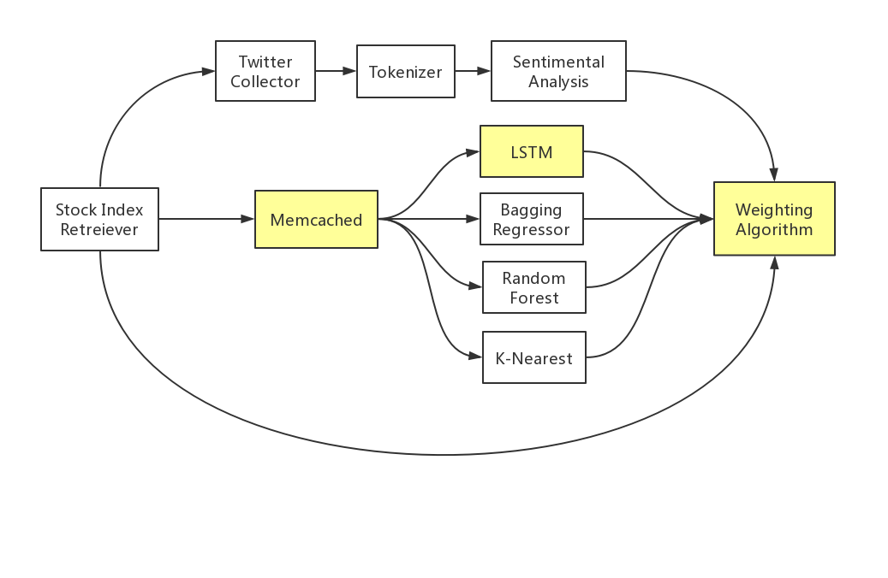

# Model_Servicing

Implementation of chains of ML Models linked with RPC with possible real-life applications.

## Sppech Analysis 

### Project Structure

### Requiement

 * spacy
 * genism
 * tensorflow
 * pymemcache
 * NLPK with pretrained punkt
 * CMU-pocketsphnix: I followed the installation guide [here](https://github.com/Uberi/speech_recognition/blob/master/reference/pocketsphinx.rst)

  
## Stock Prediction 

### Project Structure

### Requiement

 * quandl 3.3.0
 * matplotlib 2.1.1
 * fbprophet 0.2.1
 * pystan 2.17.0.0
 * pandas 0.22.0
 * pytrends 4.3.0